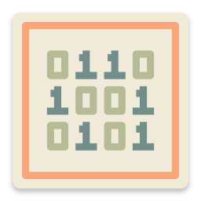
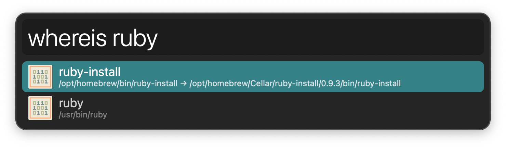

#  Where’s the Binary Alfred Workflow

Get the full path to executables in your PATH

[⤓ Install on the Alfred Gallery](https://alfred.app/workflows/alfredapp/wheres-the-binary)

## Usage

Search for executables in [PATH](https://en.wikipedia.org/wiki/PATH_%28variable%29) via the `whereis` keyword.

* <kbd>↩&#xFE0E;</kbd> Copy original path.
* <kbd>⌥</kbd><kbd>↩&#xFE0E;</kbd> Copy resolved path if original is a [symbolic link](https://en.wikipedia.org/wiki/Symbolic_link).
